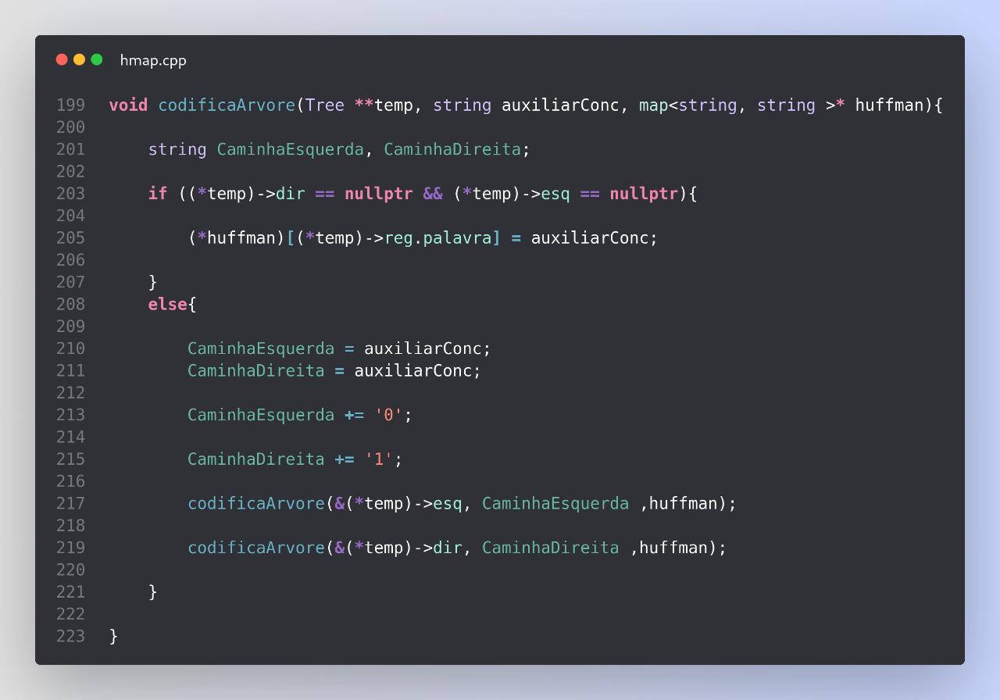
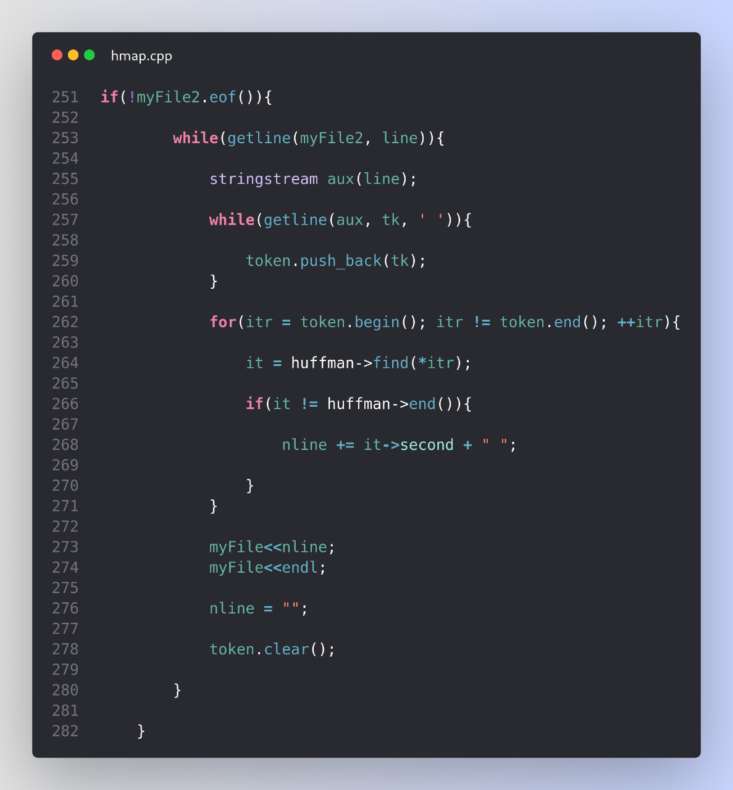

# HUFFMAN CODING 🖥️

<h1>OBJETIVO 💡</h1>

Elabore uma árvore binária que utilize o código de Huffman para comprimir arquivos. Para tanto:  
	- [ X ] contabilizar a recorrência de cada palavra (RP) no arquivo;  
	- [ X ] normalizar a contabilização entre 0 e 1 utilizando a formula -> RP / (max(RP) - min(RP));  
	- [ X ] Montar a árvore com as regras apresentadas por Huffman; 
	- [ X ] Troque as palavras pela codificação binária (utilizar booleano para representar 0 e 1);  
	- [ X ] Salve o arquivo em formato binário e observe qual foi o ganho de espaço obtido.
 

<h1>INTRODUÇÃO 📌</h1>

<b>DAVID A. HUFFMAN (1925-1999)</b> cresceu em Ohio. Com 18 anos, formou-se em engenharia elétrica na Universidade Estadual de Ohio. Huffman entrou para o corpo doscente do <strong>MIT</strong> em 1953, onde permaneceu até 1967. O algoritmo tem como entrada frequências, e produz como saída um código de prefixo binário. Este algoritmo, conhecido como <b>codificação de Huffman</b> é amplamente usada para comprimir sequências de bits que representam textos e também desempenha um papel importante na compressão de arquivos de áudio e de imagens.

<h1>LÓGICA UTILIZADA 📄</h1>
<h2>Início</h2>
Para a conclusão dessa tarefa, utilizou-se a biblioteca <code>unordered_map</code>. No <strong>main()</strong>, um mapa no qual carrega uma variável do tipo <i>String</i> e um <i>Inteiro</i> é criado e passado como parâmetro para a função que irá ler o arquivo. Neste primeiro mapa, assim como sua declaração de <string, int> mostra, <code>->first,</code> carregará uma palavra, enquanto <code>->second</code>, carregará o número no qual esta palavra repetiu durante o texto. 
<h2>Leitura e tratamento do arquivo</h2>
Para a leitura, tratamento e contagem das palavras no arquivo de texto, utilizou-se da mesma estrutura do trabalho 'TF-IDF', o qual consegue tokenziar as linhas do texto, filtrando palavras julgadas desnecessárias e tratando acentuações e pontuações. A única alteração que a funçaõ original sofreu foi que agora, a palavra da vez, inserida dentro da variável [AUX] é buscada dentro do mapa. Caso já exista essa palavra, é somado +1 ao inteiro associado a ela, caso contrário, é inserida e o contador é inicado com 1. 
<h2>Cálculo do (RP)</h2>
Como citado na função anterior, o mapa além das palavras, carrega consigo um valor inteiro referente a quantidade de reincidencias da mesma. No <strong>main()</strong>, a função <code>calculaHuffman</code> é chamada e recebe o mapa já com as palavras e seus devidos valores de repetição dentro. Aqui, é necessário sabermos qual foi a palavra que menos repetiu e a que menos repetiu, para ser possível fazer o cálculo do RP, onde sua fórmula é: 

	<i>RP = RP / RP(max) - RP(min)</i>ㅤㅤ <b>(1.0)</b>

 
O 'RP' é o valor de <b>R</b>eincidência da <b>P</b>alavra. Este valor será usado na montagem da árvore, mas isso será explicado mais a frente.
Para conseguir o 'RP(max)/(min)' foi usado uma estrutura muito simples, o BubbleSort. Cada repetição do looping compara todos os valores contidos no mapa com variáveis externas de valor fixo. Dessa forma, é certo que as variáveis 'MAIOR' e 'MENOR' ao final, carregarão respectivamente os maiores e menores valores de incidência. Agora é possível utilizar a fórmula (1.0) para calcular o RP de cada palavra. 
<h3>Normalização da palavra</h3>
A normalizaçao da palavra diz respeito a execuçao da fórmula já citada acima. Seu resultado será armazenado na variável <i>float 'huffman'</i>, na sessão <code>->second</code> do mapa. Após isso, vamos montar nossa árvore. 
<h2>Inserção na árvore</h2>
A função <code>insereArvore</code> foi pensada para funcionar da seguinte forma:
<ul>
	<li>Um vector do tipo <Tree*> é criado;</li>
	<li>Um looping que percorre todo o mapa, irá passo a passo, inserindo a palavra <code>->first</code> do mapa no Record 'palavra' da árvore e seu valor RP <code>->second.huffman</code> no Record 'huffman' da árvore;</li>
	<li>Os filhos desse vértice criado são igualados a 'vazio';</li>
	<li>Os dados coletados e inseridos na árvore são inseridos no vetor pela função push_back();</li>
</ul>
Após essa etapa, teremos um vetor de árvore onde cada posição carrega a palavra e seu número RP dentro. Utilizado a função <code>sort()</code> o vetor é ordenado, garantindo que suas duas primeiras posições equivalem aos dois menores valores RP calculados. Um looping <code>while</code> irá repetir enquanto o vector nao possuir apenas uma posição. <b>O que isso significa?</b> Bem, as duas primeiras posições (menores) , serão somadas, obtendo um novo valor. Feito isso, as duas primeiras posições são apagadas do vetor e, o resultado da soma delas é novamente inserido no vetor, ordenado novamene após cada inserção. Dessa forma, somando sempre os dois menores, ao final, o vector terá apenas uma posição. Lembrando que este é um vetor do tipo <Tree*>, já é possível codificarmos nossa árvore, visando a compactação. Ao final da função, um novo mapa é criado. Este, por sua vez, carrega duas <code>Strings</code> como conteúdo. A primeira delas, carregará a palavra, assim como no primeiro mapa. A segunda, será responsável por carregar sua codificação, composta por (0 e 1) . Com o segundo mapa criado, a codificação será feita. 
<h2>Codificação</h2>
A função <code>codificaArvore</code> é responsável por este módulo. A recursividade foi o caminho escolhido para que fosse possivel percorrer por toda a árvore, atribuindo '0' aos filhos esquerdos e '1' aos filhos direitos. A recursão foi feita a partir da essência da função <code>preordem</code>. Dessa forma, a função é chamada dentro dela mesmo, ora passando a árvore->esq, ora a árvore->dir.
Ao chegar nas folhas da árvore, um <i>if</i> irá notar o fim da árvore e na palavra em questão <code>*t->reg.palavra</code> irá receber uma strig externa que, a cada recursão, concatenou os valores numéricos recolhidos através do caminho percorrido até a folha, como mostra a figura <b>(1)</b>. 

<i>Figura 1: Função recursiva para codificar a árvore de huffman.</i>

<h2>Inscrição no arquivo</h2>
Para escrever no arquivo, a função <code>escreveArquivo</code> irá abrir novamente  o arquivo original e tokenizar novamente as linhas. Tendo cada palavra ocupando uma posição do vector 'token'. Um looping irá percorrer todo o vetor token recém criado e procurar a a palavra da vez <code>token[ i ]</code> dentro do mapa. Caso seja encontrada a palavra dentro do mapa, uma string vazia recebe o <code>it->second</code> (ou seja, a codificação daquela palavra) . Dessa forma, a string antes vazia agora carrega a codificação da palavra X. Feito isso, a string é escrtia no arquivo e limpa logo em seguida, esperando receber a codificação da palavra seguinte <code>token[ i + 1 ]</code>. Chegando ao fim do arquivo original, ambos são fechados e o programa está finalizado. A figura <b>(2)</b> demonstra a estrutura da função a partir da tokenização.

<i>Figura 2: Função que, após tokenziar as frases, procurar no mapa e escreve no arquivo.</i>

<h1>REPRESENTAÇÃO GRÁFICA 📈</h1>
Para demonstração, o teste será feito utilizando o arquivo mostrado na figura <b>(3)</b> com <i>91,302</i> (91,3MB). 

ㅤㅤㅤㅤㅤㅤㅤㅤㅤㅤ
<i>Figura 3: Documento .txt no qual o programa irá compactar.</i>

Após a execução do programa, que pode demorar alguns segundos dependendo do tamanho do arquivo desejado, o arquivo de saída deverá ser preenchido com o código. Agora será possível verificar e comparar o tamanho e a efetividade da compactação.

ㅤㅤㅤㅤㅤㅤㅤㅤㅤㅤ
<i>Figura 4: Documento .txt já compactado.</i>

Como é possível perceber, o arquivo teve seu tamanho reduzido para <i>86,750</i> (86,7MB), ou seja, reduziu em 5%, provando a eficácia do código. Pode-se concluir também que, para arquivos menores, a compactação é menos eficiente, ou seja, quanto maior o arquivo a ser compactado, melhor será o resultado.

<h1>COMPILAÇÃO E EXECUÇÃO 🔌</h1>
O programa feito de acordo com a proposta possui um arquivo Makefile que realiza todo o procedimento de compilação e execução. Para tanto, temos as seguintes diretrizes de execução:   

| Comando                |  Função                                                                                           |                     
| -----------------------| ------------------------------------------------------------------------------------------------- |
|  `make clean`          | Apaga a última compilação realizada contida na pasta build                                        |
|  `make`                | Executa a compilação do programa utilizando o gcc, e o resultado vai para a pasta build           |
|  `make run`            | Executa o programa da pasta build após a realização da compilação    

<h1>BIBLIOTECAS 📚</h1>
Para o funcionamento desejado, é necessário incluir as seguintes bibliotecas no programa: 
<ul>
	<li><code>#include 'stdio.h'  </code></li>
	<li><code>#include 'stdlib.h'</code></li>
	<li><code>#include 'stdbool.h'</code></li>
	<li><code>#include 'iostream'</code></li>
	<li><code>#include 'string'</code></li>
	<li><code>#include 'sstream'</code></li>
	<li><code>#include 'map'</code></li>
	<li><code>#include 'fstream'</code></li>
	<li><code>#include 'vector'</code></li>
	<li><code>#include 'algorithm'</code></li>
</ul>

<h1>AUTOR 👤</h1>
Criado por Henrique Souza Fagundes;

Aluno do 4° periodo do curso de `Engenharia da Computação` no [CEFET-MG](https://www.cefetmg.br)
